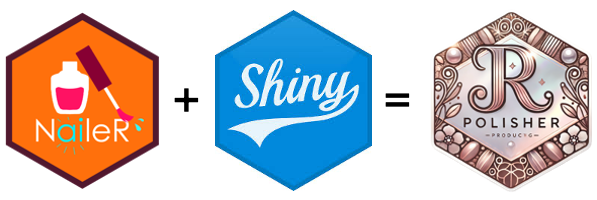

<br />
<div align="center">
  <a href="https://github.com/Sebastien-Le/PolisheR">
    
  </a>

  <h3 align="center">PolisheR</h3>

  <p align="center">
    <i>When NaileR meets Shiny...Give NaileR a shiny new look with PolisheR!</i>
</div>


# PolisheR

<!-- badges: start -->

<!-- badges: end -->

**PolisheR** is an extension package for
[`NaileR`](https://github.com/Sebastien-Le/NaileR), designed to make
statistical outputs easier to read, interpret, and communicate. It
provides interactive Shiny applications that use Language Models (LLMs)
to help you **recode**, **summarize**, and **rename** variables and
outputs.

## Installation

You can install the development version of PolisheR from GitHub with:

``` r
devtools::install_github('Sebastien-Le/PolisheR')
library(PolisheR)
```

## Available Shiny Apps

| App Function | Purpose |
|----|----|
| `shiny_nail_catdes()` | Interpret categorical associations via `catdes()` (with report) |
| `shiny_nail_condes()` | Summarize numeric associations via `condes()` (with report) |
| `shiny_nail_qda()` | Interactive app for QDA interpretation (with report) |
| `shiny_renaime()` | Rename variables using a local LLM via `ollama` |

------------------------------------------------------------------------

## Example - QDA Interpretation

``` r
library(PolisheR)
library(SensoMineR)

data(chocolates)
shiny_nail_qda(sensochoc)
```

------------------------------------------------------------------------

## Example - Rename Variables Using a Local LLM

``` r
df <- data.frame(
  "How often do you buy organic food?" = c(1, 2, 3),
  "In general, do you trust food labels?" = c(4, 5, 2)
)

shiny_renaime(df)
```

This launches an app that: - Uses a local LLM via
[`ollama`](https://ollama.com/) (e.g., LLaMA 3) - Automatically suggests
short, clean variable names (less than 20 characters) - Allows manual
editing before export - Provides CSV download and direct application to
the dataset

------------------------------------------------------------------------

## Version History

### PolisheR 1.1.3

- **New** `shiny_renaime()` app to rename variables with LLMs
- Report generation improved in all main apps
- Warnings for duplicate/failed label generation in renaming tool

### PolisheR 1.1.2

- Report generation added to `shiny_nail_qda()`, `shiny_nail_catdes()`,
  and `shiny_nail_condes()`

### PolisheR 1.1.1

- upport for `sample.pct` in `shiny_nail_condes()`
- Improved prompt cleaning with `clean_text()`
- Fixed bug in `get_sentences_condes()` where `Estimate` could be
  non-numeric
